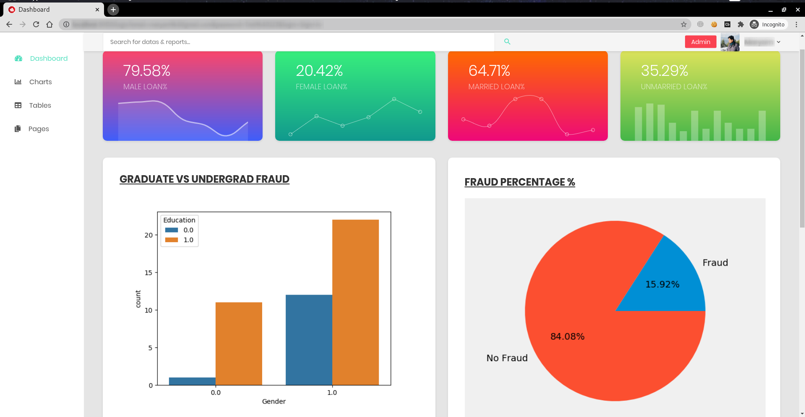

# DetectFraud - AI-Based Fraud Detection System
Machine Learning Based Fraud Detection Application using Test Driven Development Approach.

    

[![Contributors][contributors-shield]][contributors-url]
[![Forks][forks-shield]][forks-url]
[![Stargazers][stars-shield]][stars-url]
[![Issues][issues-shield]][issues-url]
[![MIT License][license-shield]][license-url]
[![LinkedIn][linkedin-shield]][linkedin-url]

# AngularSpree

**AngularSpree is an Angular(7) e-commerce application.**

It is a plug and play frontend application for [AviaCommerce API](https://www.aviacommerce.org/docs/apis-getting-started.html) built using Angular(7), Redux, Observables & ImmutableJs.

**It is not limited to aviacommerce and can also be used with any e-commerce solution with an api interface. Such as spreecommerce, magento, opencart etc.**

- 🌍 [aviacommerce](https://aviacommerce.org/) - Learn more about AngularSpree
- 📖 [Documentation](https://www.aviacommerce.org/docs/frontend-install.html)
- 📚 [API Documentation](https://www.aviacommerce.org/docs/apis-getting-started.html)
- 👍 Like us on [Facebook](https://www.facebook.com/aviacommerce)
- 🕊 Twitter: [@aviacommerce](https://twitter.com/aviacommerce) - Get the latest news
- 🐞 Issue Tracker: - [Issues](https://github.com/aviacommerce/avia/issues) - Report bugs here
- 🗨 [Forums](https://forum.aviacommerce.org/) - Discussions(Coming soon)
- 👪 [Community Chat](https://gitter.im/avia-commerce/Lobby) - Gitter

### Important Note

AngularSpree is now a part of [Aviacommerce Project](https://aviacommerce.org). Further development of angularspree will happen in _this repository only_. Also, check the [aviacommerce repo](https://github.com/aviacommerce/avia) where this repository exists as a submodule.

## Features

Please check the online demo [here](https://www.aviacommerce.org/demo/demo.html).

### Features of this mobile appliction are:-

1. Product List Page
2. Product Detail Page
3. Filters by Category, options, size etc
4. Sort(New arrival, Price)
5. Advanced searching and autocomplete with Elasticsearch
6. Add/update to cart
7. Notifications for order update notification, payment failure
8. Chat with seller feature, messaging
9. Payment methods(COD, Stripe, Payubiz, RazorPay and 29 others)

### Admin has following features for sellers:-

1. Add/update products/inventory.
2. Manage orders
3. Manage Categories/Taxonomies
4. Support for Variants and Option Types, Option Sets
5. Shipping settings/policy(free shipping, shipping rules)
6. Promotions(coupons per user, total usage count)
7. Manage Users(admin, user types)
8. Taxation
9. Send emails and notifications.

### Quick Links

| [Gitter](https://gitter.im/avia-commerce/Lobby) | [Contributing](https://www.aviacommerce.org/docs/how-to-contribute.html) | [API Specs](https://www.aviacommerce.org/docs/apis-getting-started.html) |
| ----------------------------------------------- | ------------------------------------------------------------------------ | ------------------------------------------------------------------------ |

This project is an open-source initiative by[ Aviabird Technologies](https://aviabird.com) under the [Aviacommerce](https://aviacommerce.org) open-source project.

For any questions or suggestions send a mail to `hello@aviabird.com` or chat with the core-team on [gitter](https://gitter.im/avia-commerce/Lobby).

[contributors-shield]: https://img.shields.io/github/contributors/u-ahmedofficial/DetectFraud.svg?style=flat-square
[contributors-url]: https://github.com/u-ahmedofficial/DetectFraud/graphs/contributors
[forks-shield]: https://img.shields.io/github/forks/u-ahmedofficial/DetectFraud.svg?style=flat-square
[forks-url]: https://github.com/u-ahmedofficial/DetectFraud/network/members
[stars-shield]: https://img.shields.io/github/stars/u-ahmedofficial/DetectFraud.svg?style=flat-square
[stars-url]: https://github.com/u-ahmedofficial/DetectFraud/stargazers
[issues-shield]: https://img.shields.io/github/issues/u-ahmedofficial/DetectFraud.svg?style=flat-square
[issues-url]: https://github.com/u-ahmedofficial/DetectFraud/issues
[license-shield]: https://img.shields.io/github/license/u-ahmedofficial/DetectFraud.svg?style=flat-square
[license-url]: https://github.com/u-ahmedofficial/DetectFraud/blob/master/LICENSE.txt
[linkedin-shield]: https://img.shields.io/badge/-LinkedIn-black.svg?style=flat-square&logo=linkedin&colorB=555
[linkedin-url]: https://www.linkedin.com/in/umairahmedofficial/

